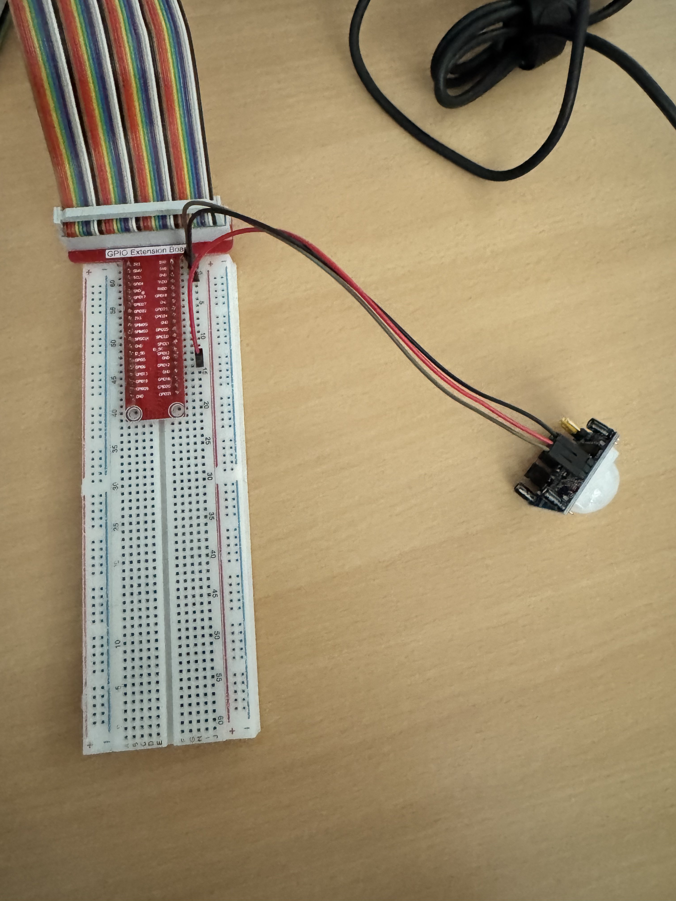
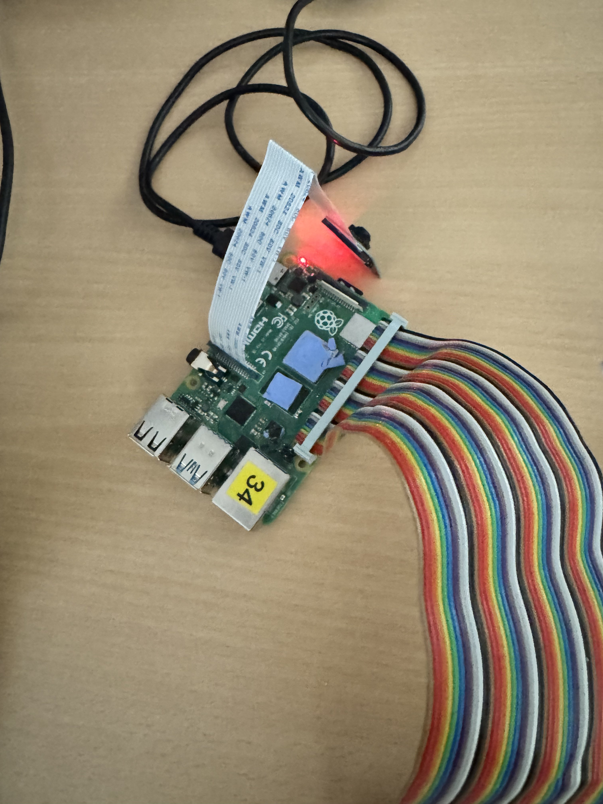

# Pi-Project Security Camera – Fabian Kleine und Gian-Lucca Kaworsky

## Einrichten des Projekts auf dem Pi

Das Repository liegt einmal unter `/var/www/html/pi-project-security-camera` für das PHP-Backend und einmal unter `/home/it/pi-project-security-camera` um das Python-Script auszuführen.

## Python-Script starten

### Virtual Environment einrichten (einmalig)

Falls noch keine `.venv` existiert, muss sie zuerst erstellt werden:

```bash
python3 -m venv python/.venv
pip install -r python/requirements.txt
```

### Virtual Environment aktivieren

```bash
source python/.venv/bin/activate
```

### Script ausführen

```bash
python3 python/main.py
```

Das Script wartet auf eine Bewegungserkennung durch den HC-SR501 PIR-Sensor. Wird Bewegung erkannt, nimmt die Kamera automatisch ein Video auf und speichert einen Thumbnail in der Datenbank. Das Programm läuft in einer Endlosschleife und wird mit `Ctrl+C` beendet.

## Frontend

In [frontend/src/config.ts](frontend/src/config.ts) muss zunächst die IP-Adresse des Backends eingetragen werden. Entweder direkt in der Datei oder über Umgebungsvariablen:

```ts
// frontend/src/config.ts
export const API_BASE_URL = import.meta.env.VITE_API_BASE_URL ?? "http://<IP-Adresse>"
export const PUBLIC_URL = import.meta.env.VITE_PUBLIC_URL ?? "http://<IP-Adresse>/"
export const UPDATE_INTERVAL_MS = 5 * 60 * 1000
```

Das Frontend lässt sich dann mit folgendem Befehl starten:

```bash
cd frontend
npm install
npx vite --host
```

Das Frontend ist dann unter `<IP-Adresse>:5173` aufrufbar.

### Web-Oberfläche

#### Eigenentwicklung

Die folgenden Dateien stammen nicht von genutzten Libraries oder Ähnlichem und wurden eigenständig entwickelt:

```
frontend/
    └── src/
        ├── components/
        │   ├── VideoList.tsx
        │   └── VideoModal.tsx
        ├── data/
        │   └── videos.ts
        ├── App.tsx
        └── config.ts
```

## Backend

Im `backend`-Ordner liegt ein PHP-Projekt, welches mit PDO eine Verbindung zur Datenbank aufbaut und eine API bereitstellt.

## Verkabelung

### HC-SR501 Bewegungssensor

| Sensor | Pi |
| --- | --- |
| VCC | 5V |
| OUT | GPIO 12 |
| GND | GND |

### Raspberry Pi Kamera

Die Kamera wird über den CSI-Anschluss des Raspberry Pi verbunden.

### Bilder der Schaltung

#### Bewegungssensor (HC-SR501)



#### Kamera


